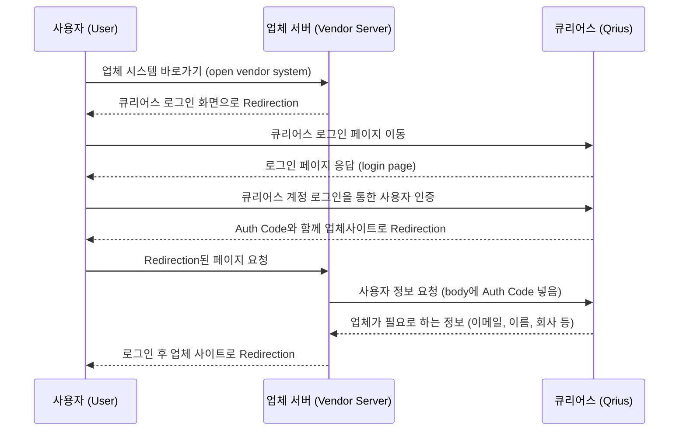

# Qrius Login OAuth 2.0 — Vendor Integration Guide

> **Source:** `큐리어스 로그인을 통한 업체 로그인(OAuth2.0).pptx` — supplied by LG CNS.
> **Purpose:** Reference for integrating Qrius (LG Academy SSO) as the OAuth 2.0
> identity provider for `lg_magazine` (the vendor / 업체 side).
> **Transcribed from:** the PPTX slides shared by LG CNS.

---

## Slide 1 — Sequence diagram (로그인 흐름)

**Actors:** 사용자 (User) · 업체 서버 (Vendor Server) · 큐리어스 (Qrius)

### Step-by-step

| # | From → To | Action (KR) | Meaning (EN) |
|---|---|---|---|
| 1 | User → Vendor | 업체 시스템 바로가기 | User opens the vendor system. |
| 2 | Vendor → User | 큐리어스 로그인 화면으로 Redirection | No session → redirect the user to the Qrius login screen. |
| 3 | User → Qrius | 큐리어스 로그인 페이지 이동 | Browser navigates to the Qrius login page. |
| 4 | Qrius → User | 로그인 페이지 응답 | Qrius returns the login page. |
| 5 | User → Qrius | 큐리어스 계정 로그인을 통한 사용자 인증 | User submits credentials; Qrius authenticates them. |
| 6 | Qrius → User | Auth Code와 함께 업체사이트로 Redirection | On success, Qrius redirects back to the vendor URL with an `AUTH_CODE`. |
| 7 | User → Vendor | Redirection된 페이지 요청 | Browser requests the redirected vendor page. |
| 8 | Vendor → Qrius | 사용자 정보 요청 (body에 Auth Code 넣음) | Vendor POSTs the `AUTH_CODE` (in the request body) to the user-info API. |
| 9 | Qrius → Vendor | 업체가 필요로 하는 정보 (이메일, 이름, 회사 등) | Qrius returns the fields the vendor needs (email, name, company, …). |
| 10 | Vendor → User | 로그인 후 업체 사이트로 Redirection | Vendor mints its own session and redirects the user into the app. |

---

## Slide 2 — Step-by-step protocol

> ⚠️ **Not yet transcribed** — Slide 2 was not legible in the shared screenshots.
> Needs a clear capture of Slide 2 to fill in the exact endpoints / request &
> response shapes. Known details from the CNS email so far:
>
> - **Qrius login page URL:** `https://www.lgacademy.com/login/index.php?redirect_uri={VendorURL}`
> - **User-info API:** `POST` with `Content-Type: application/json`, body `{"code": "AUTH_CODE"}`.
>   The URL is **issued by CNS only after the data scope is agreed** (not yet received).
> - **Logout URL:** `https://www.lgacademy.com/login/logout.php?isvendor=1` — must be
>   called when the user logs out of the vendor system.
> - No separate app registration / `CLIENT_ID` is issued by CNS.

---

## Slide 3 — Work split (작업 분담)

### LGCNS 작업 (큐리어스) — LG CNS side

- 큐리어스 로그인 페이지 URL 생성 — Create the Qrius login-page URL.
- `AUTH_CODE` 코드 생성 — Generate the `AUTH_CODE` on successful login.
- 큐리어스 사용자 정보 조회 API URL — Provide the Qrius user-info query API URL.

### 업체작업 — Vendor side (us / `lg_magazine`)

- 세션정보가 없을 경우 큐리어스 로그인 페이지로 이동 개발 — When there is no
  session, redirect the user to the Qrius login page.
- 업체 URL 생성 — Create / register the vendor URL (the callback).
- 사용자 정보 조회 API 호출 개발 — Implement the call to the user-info API.

---

## How `lg_magazine` implements this

| Spec item | Where it lives |
|---|---|
| Redirect to Qrius when no session | `src/proxy.ts` → `src/app/api/auth/qrius/login/route.ts` |
| Vendor callback URL (receives `AUTH_CODE`) | `src/app/api/auth/qrius/callback/route.ts` |
| User-info API call | `exchangeCodeForUser()` in `src/lib/qrius/client.ts` |
| Vendor session (after step 9) | HMAC-signed cookie — `src/lib/qrius/session.ts` |
| Logout (incl. Qrius logout URL) | `src/app/api/auth/qrius/logout/route.ts` |

### Outstanding (vendor side)

1. **Confirm the field set** with the LG Academy contact + HRD security manager
   (likely `userid` + email + name) so CNS issues the user-info API URL.
2. **Register the production vendor callback URL** with CNS and set it as
   `QRIUS_REDIRECT_URI`.
3. Once `QRIUS_USERINFO_URL` arrives, set `QRIUS_MOCK=0` and test the real flow
   with the CNS test account.
